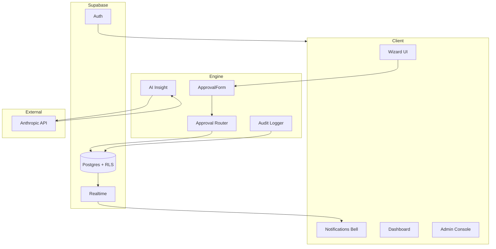
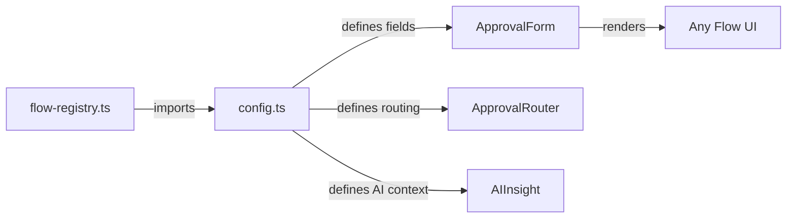
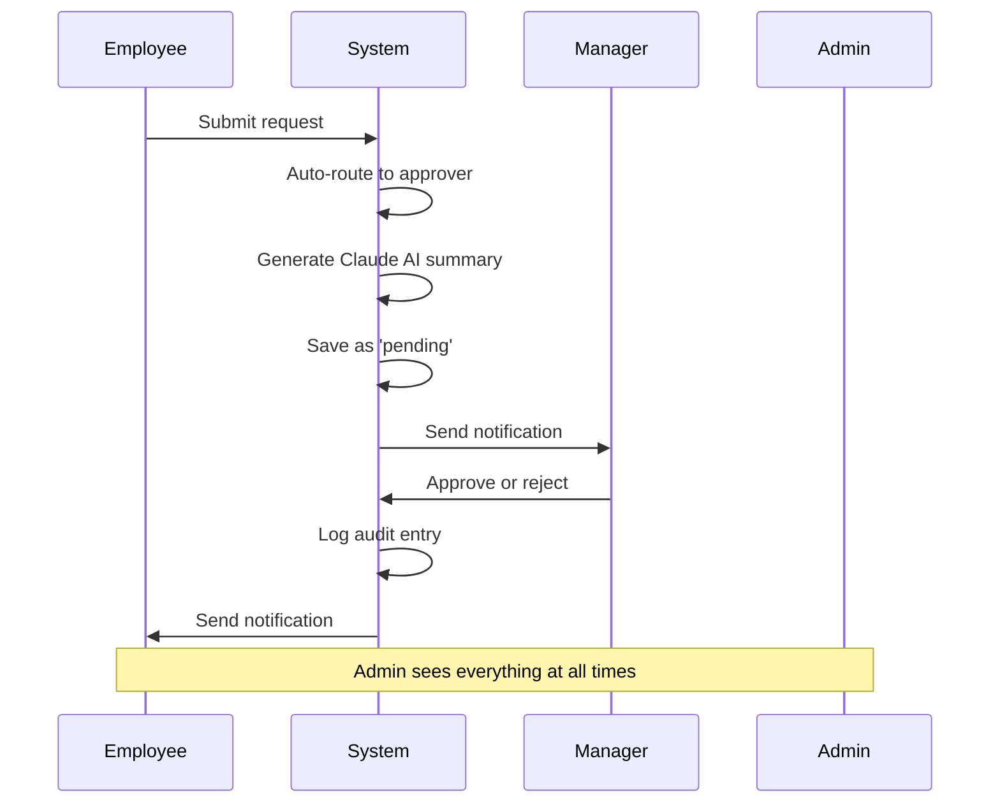
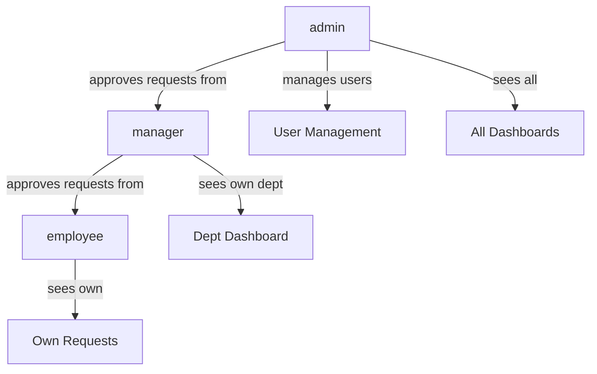
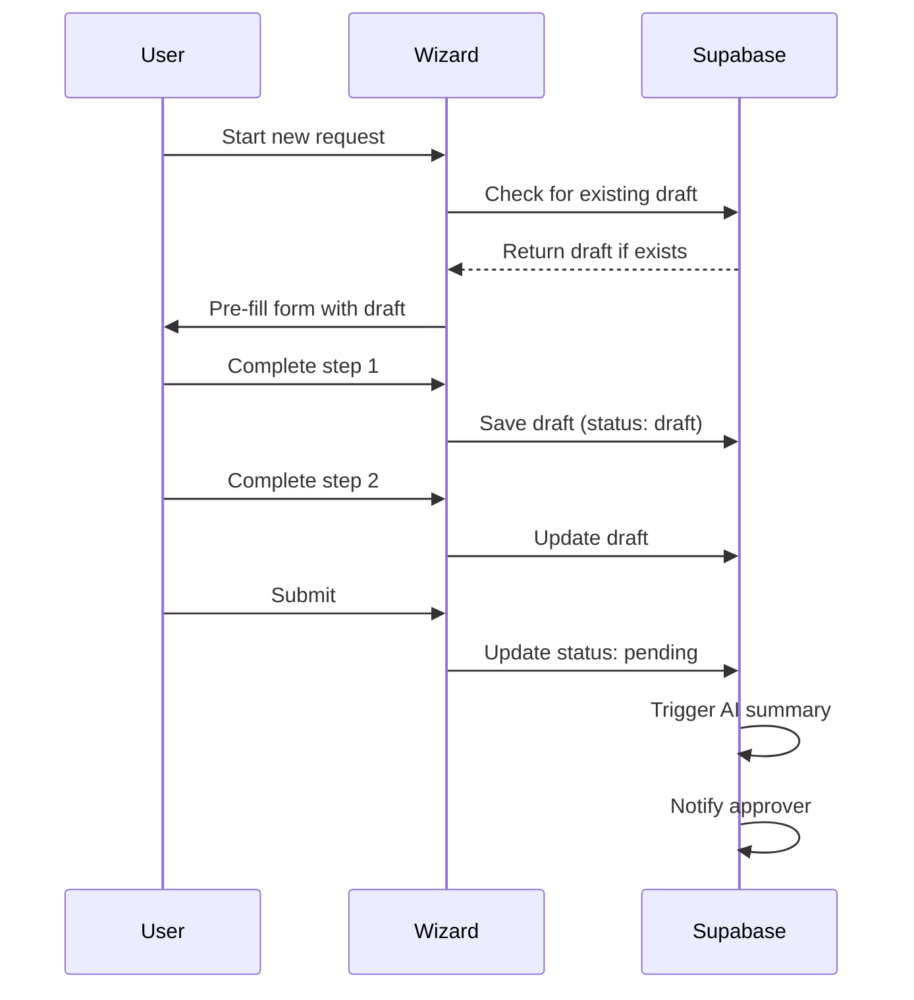

# Architecture — Mal Approval Engine

## Overview



---

## Core Concept

Every approval flow has the same skeleton:

```
Request Form → Submitted → Under Review → Approved/Rejected
```

What changes between flows:
- Form fields
- Display label
- AI context prompt
- Validation rules

What never changes:
- Auth and routing
- Database structure
- Approval logic
- Notification system
- Audit trail
- UI shell

This means: **build the engine once, add flows forever.**

---

## Config-Driven Engine



Adding a new flow = one config file + one schema file
+ one line in flow-registry.ts

---

## Folder Structure

```
src/
  flows/                    ← one folder per flow
    budget-request/
      config.ts             ← FlowConfig implementation
      schema.ts             ← Zod validation schema
      schema.test.ts        ← validation tests
    leave-request/
      config.ts
      schema.ts
      schema.test.ts

  engine/                   ← shared, flow-agnostic
    ApprovalForm.tsx        ← renders any flow's form
    RequestCard.tsx         ← renders any request
    ApproverView.tsx        ← approve/reject any request
    AIInsight.tsx           ← Claude summary component
    StatusBadge.tsx         ← shared status display
    CalendarField.tsx       ← date/daterange picker

  lib/
    supabase.ts             ← client-side supabase
    supabase-server.ts      ← server-side supabase
    anthropic.ts            ← claude client (server only)
    flow-registry.ts        ← imports all flow configs
    approval-router.ts      ← routes to correct approver
    audit.ts                ← logs every state change
    notifications.ts        ← creates notifications

  types/
    flow.types.ts           ← FlowConfig, Request types
    profile.types.ts        ← Profile, Role types

  app/
    (auth)/
      login/page.tsx
      invite/[token]/page.tsx

    (employee)/
      dashboard/page.tsx
      [flowType]/
        new/page.tsx
        [id]/page.tsx

    (manager)/
      dashboard/page.tsx
      request/[id]/page.tsx

    (admin)/
      dashboard/page.tsx
      users/page.tsx
      users/invite/page.tsx
      request/[id]/page.tsx

    api/
      requests/route.ts
      requests/[id]/approve/route.ts
      requests/[id]/reject/route.ts
      invites/route.ts
      ai/summarize/route.ts
      ai/assist/route.ts

  components/
    ui/                     ← shadcn components
    layout/
      Header.tsx
      Sidebar.tsx
      RoleGuard.tsx         ← protects routes by role

docs/
  architecture.md           ← this file
  database.md
  flows.md
  security.md
  testing.md
  git.md
  verification.md
  notifications.md
  decisions/
    001-config-driven-flows.md
    002-jsonb-form-data.md
    003-rls-security.md
    004-draft-persistence.md
    005-notification-strategy.md
    006-approval-routing.md
  prompts.md                ← auto-maintained build log
  presentation.md
```

---

## FlowConfig Type

```typescript
export type FieldType =
  | 'text'
  | 'textarea'
  | 'number'
  | 'select'
  | 'date'
  | 'daterange'    // renders CalendarField
  | 'email'

export interface FlowField {
  id: string
  label: string
  type: FieldType
  required: boolean
  placeholder?: string
  options?: string[]       // for select fields
  hint?: string            // helper text
  aiAssist?: boolean       // show Help me write button
}

export interface FlowConfig {
  id: string               // kebab-case, matches folder
  label: string            // display name
  description: string      // shown on form
  icon: string             // lucide icon name
  fields: FlowField[]
  aiAssistEnabled: boolean
  aiPromptContext: string  // tells Claude what this is
  approvalChain: {
    employee: 'manager'
    manager: 'admin'
    admin: 'self'
  }
}
```

---

## Approval Flow



---

## Role Hierarchy



---

## Draft Persistence



---

## Environment Variables

```
NEXT_PUBLIC_SUPABASE_URL        ← public, safe
NEXT_PUBLIC_SUPABASE_ANON_KEY   ← public, safe
SUPABASE_SERVICE_ROLE_KEY       ← server only
ANTHROPIC_API_KEY               ← server only
```
