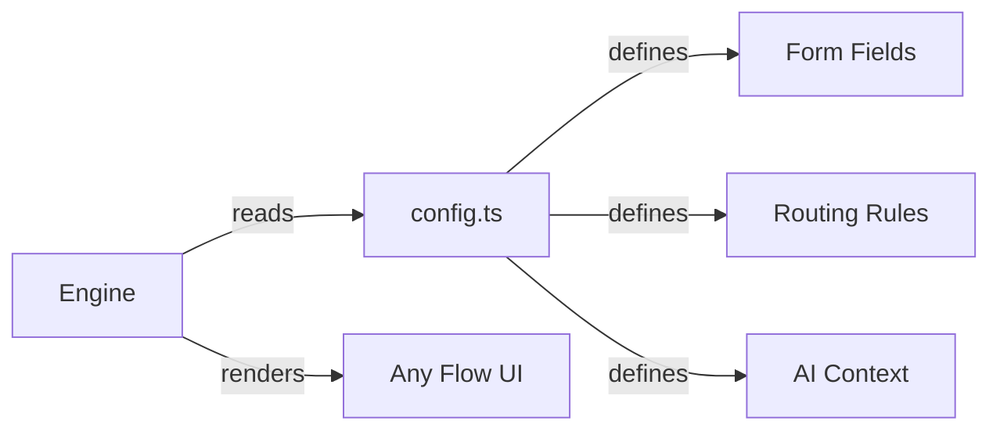
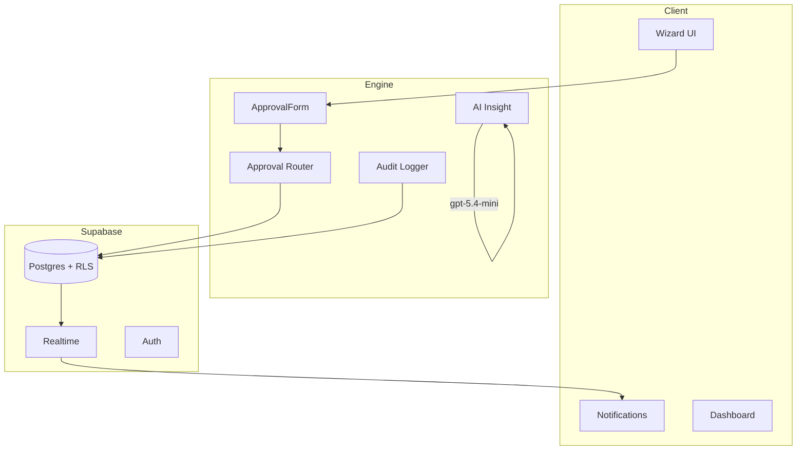

# Presentation — Mal Approval Engine

## Format
Live demo + walkthrough
Target: 6-8 minutes total

---

## 1. The Problem (30 seconds)

"Most companies have no clean way for employees
to request things that need approval.
It's scattered across email, Slack, and spreadsheets.
No audit trail. No visibility. No consistency."

---

## 2. The Insight (30 seconds)

"Every approval flow has the same skeleton.
What changes is the form and the routing.
So we built the platform once."

---

## 3. Architecture (1 minute)

Show:
- CLAUDE.md — "written before any code"
- docs/ structure — "how a real team works"
- RLS policies — "security by default"
- ADRs — "every decision documented"

---

## 4. Live Demo (3 minutes)

### Scene 1 — Employee submits
Login as employee@test.com
- Show empty dashboard
- Click "New Budget Request"
- Fill form — show inline validation
- Show "Help me write" AI assist on justification
- Submit
- Show Claude AI summary generated
- Show status: Pending
- Show "Draft saved" — refresh to prove it

### Scene 2 — Manager approves (realtime)
Open new window — login as manager@test.com
- Notification bell shows 1 unread — no refresh needed
- Click notification → request detail
- Read Claude AI summary
- "Flags: justification could be more specific"
- Add approval note → Approve
- Back to employee window — notification appears

### Scene 3 — Admin sees everything
Open new window — login as admin@test.com
- Org-wide dashboard — all departments
- Can see both requests
- Can see audit trail
- User management — show invite flow

### Scene 4 — Reusability (the key moment)
"Adding a new flow takes two files."

- Open `src/flows/leave-request/config.ts` — show fields, AI context
- Open `src/flows/leave-request/schema.ts` — show Zod schema
- Add the id to `flow-registry.ts` — one line
- Leave request form appears with calendar, overlap detection, AI summary
- "That's it. The engine handles everything else."

---

## 5. How It Was Built (1 minute)

Show docs/prompts.md:
"This is the living build log.
Every prompt, every decision, every gotcha.
Claude Code built this with me, not for me.
Every decision in this log is mine."

Show commit history:
"Meaningful commits, logical progression.
Production discipline on a prototype."

Show ADRs:
"Six architecture decisions documented before
writing a line of code."

---

## 6. Quality (30 seconds)

- Unit tests on critical logic:
  routing, validation, AI fallback, audit, notifications
- RLS on every table
- Audit trail on every status change
- Draft persistence across devices
- Idempotency prevents duplicate submissions
- Graceful AI fallback if Claude API fails

"Most prototypes skip all of this.
At Mal, a prototype sometimes ships."

---

## 7. What's Next (30 seconds)

High:
- Arabic RTL (already built in another project)
- Email notifications via Supabase edge functions
- access-request and vendor-payment flows

Medium:
- Mobile-first optimisation
- Bulk approval for admins
- Analytics and reporting

---

## 8. The Meta Point (15 seconds)

"I didn't wait for a job posting to start building.
I built the Zakat calculator before applying.
I wrote the architecture doc before touching Claude Code.

That's not a tactic.
That's how I work."

---

## Visuals Checklist

Mermaid diagrams (in this file):
- [ ] Config engine diagram
- [ ] System architecture
- [ ] Approval sequence diagram

Screenshots to take during build:
- [ ] Employee dashboard (empty state)
- [ ] Budget request form with validation
- [ ] AI assist generating justification
- [ ] Claude AI summary on submission
- [ ] Manager notification bell (realtime)
- [ ] Manager approval view with AI summary
- [ ] Admin org-wide dashboard
- [ ] Leave request with calendar conflicts
- [ ] Dark mode on any page
- [ ] docs/prompts.md (build log)
- [ ] Cowork board (progress tracking)
- [ ] Git commit history

---

## Note on Team Practices

This is a solo project — no Cowork board, no PR review process.
In a team setting at Mal, every task and decision would be tracked
on the Cowork board, and all changes would go through PR review.
The commit discipline and docs structure here reflect how I'd work
in that context from day one.

---

## Submission Package

- [x] Live URL — https://mal-approval-engine.vercel.app/
- [x] Test accounts (3 roles)
- [x] GitHub repo
- [x] README with setup instructions
- [ ] This presentation (PDF export)
